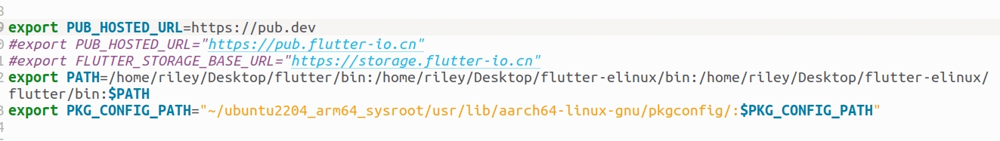
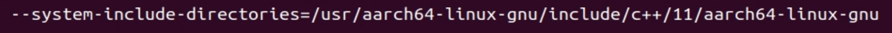
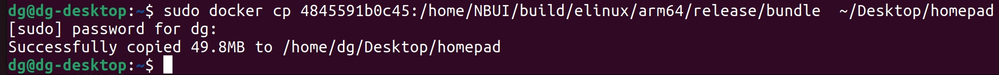

# NBUI docker 交叉编译 快 几十秒

1.首先需要拥有一个最纯净和完整的交叉编译镜像，里面都安装好工具, **这个镜像才是真正的交叉编译镜像，不需要进里面，在自己电脑上，用flutter命令里面的参数，引用这个镜像，打包只要10秒**

## step1：本机导入这个交叉编译镜像

```apache
docker load < crossArm64.tar
docker images   //查看id
docker tag a01baa71e563 pureubuntu:flutter-elinux
```

## step2: **本机预装**

sudo apt install qemu-user-static gcc-aarch64-linux-gnu g++-aarch64-linux-gnu libstdc++-11-dev-arm64-cross -y

## step3: **把这镜像跑起来**

```apache
sudo docker run -it  xx:xx
```

## step4: **然后获取这个容器的id,然后拷贝这个container的id**

```apache
sudo docker ps -a
```

```apache
sudo docker cp 容器id:/  ~/ubuntu2204_arm64_sysroot
```

## step5: **然后执行export PKG\_CONFIG\_PATH=\~/ubuntu2204-arm64-sysroot/usr/lib/aarch64-linux-gnu/pkgconfig/**

或者直接配置环境变量：

**配置文件里面的是永久生效，所以配置文件配了，终端可以不用敲export。而且终端执行export是临时生效，针对当前终端窗口，你换个窗口就不行，**

step6: **然后在自己电脑的项目下面执行**

注意：你的命名是ubuntu2204_arm64_sysroot还是ubuntu2204-arm64-sysroot

如果直接flutter-elinux build elinux，那就是构建pc用的**x64**版本了，然后你要构建不同后端的，就用--target-backend-type 有这几个**wayland** (default), **gbm**, eglstream, x11

```apache
flutter-elinux build elinux --target-arch=arm64 --target-compiler-triple=aarch64-linux-gnu --target-sysroot=/home/你电脑用户名/ubuntu2204_arm64_sysroot
```

注意：若本机只有C++11，直接按照上面命令，若本机有其他版本，要加上

```apache
flutter-elinux build elinux --target-arch=arm64 --target-compiler-triple=aarch64-linux-gnu --target-sysroot=/home/riley/ubuntu2204_arm64_sysroot --system-include-directories=/usr/aarch64-linux-gnu/include/c++/11/aarch64-linux-gnu
```




# NBUI docker 交叉编译（算不上真正交叉编译）慢  几百秒

## step1 通过mubuntu:flutter-elinux镜像 打开一个容器

sudo docker run -it --cpus=12 mubuntu:flutter-elinux /bin/bash

## step2 进入/home/NBUI目录ls

## step3 git clone/pull 最新的NBUI（可直接运行）的源码

## step4 flutter-elinux build elinux

加上--target-backend-type x11，就会编译成对应的；不加默认编译wayland（电脑默认的）

flutter-elinux pub get             //可能没有库

flutter-elinux build elinux  --target-backend-type x11

flutter-elinux build elinux --target-arch=arm64

## step5 拷贝出来

3ee923349df8:/home/NBUI/build/elinux/arm64/release/bundle


