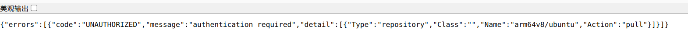

# pull images problems

### 1 运行docker pull

```apache
riley@riley-MDG-XX:~$ docker pull  arm64v8/ubuntu:22.04
Error response from daemon: Get "https://registry-1.docker.io/v2/": proxyconnect tcp: dial tcp 127.0.0.1:7890: connect: connection refused
```

### 2 报错中提到 代理错误，可能是默认或者曾经设置过什么代理，搜索方向应该就是docker 设置代理，

docker 设置代理，以及国内加速镜像设置：https://neucrack.com/p/286

docker pull 和docker build / docker run 使用的代理的方式不一样！

docker pull 的代理被systemd接管，所以需要设置systemd

```apache
sudo vim /etc/systemd/system/docker.service.d/http-proxy.conf
```

设置内容如下：（我自己用的代理是端口7097，**这里127.0.0.1是直接用了本机的http代理，重启服务才能生效**）

```apache
[Service]
Environment="HTTP_PROXY=http://127.0.0.1:7097"
Environment="HTTPS_PROXY=http://127.0.0.1:7097"
```

```apache
riley@riley-MDG-XX:~$ docker pull  arm64v8/ubuntu:22.04
Error response from daemon: Get "https://registry-1.docker.io/v2/arm64v8/ubuntu/manifests/sha256:1d19c776e76cdb32dcc72cbd44a689c9be9518b9c4ed7f9a92b38f46176b931b": EOF
```

遇到这种有链接的问题，可以点进去看什么报错信息



注意到message上有一个权限需求，故而，加上sudo（因为之前我本机电脑将docker加入了root，但是有些地方还是需要）

```apache
riley@riley-MDG-XX:~$ sudo docker pull  arm64v8/ubuntu:22.04
22.04: Pulling from arm64v8/ubuntu
4ce000a43472: Retrying in 1 second 
Get "https://production.cloudflare.docker.com/registry-v2/docker/registry/v2/blobs/sha256/4c/4ce000a43472e4a2527834764b5044674760f1e2a766480798d03a93b51a0b39/data?verify=1721010649-zYGa1V8OYnYFvO9oyyicGU4GZH8%3D": EOF
//国内很容易遇到这种网络问题，这个链接点进去是一个安装包下载
```

```apache
riley@riley-MDG-XX:~$ sudo docker pull  arm64v8/ubuntu:22.04
22.04: Pulling from arm64v8/ubuntu
4ce000a43472: Pull complete 
Digest: sha256:1d19c776e76cdb32dcc72cbd44a689c9be9518b9c4ed7f9a92b38f46176b931b
Status: Downloaded newer image for arm64v8/ubuntu:22.04
docker.io/arm64v8/ubuntu:22.04
//再运行一次又成功了
```
