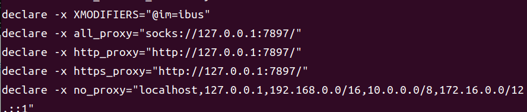

# docker安装(无法直接通过官网安装)

## 背景：通过菜鸟教程无法正常只使用两句命令完成。

菜鸟教程如下：

```
 curl -fsSL https://test.docker.com -o test-docker.sh
 sudo sh test-docker.sh
```

使用该命令后，我出现的问题如下，有点多，一个一个解决

```
错误:100 https://download.docker.com/linux/ubuntu jammy InRelease
  无法发起与 download.docker.com:443 (2a03:2880:f10c:83:face:b00c:0:25de) 的连接 - connect (101: 网络不可达) 无法连接上 download.docker.com:443 (108.160.163.102)，连接超时
正在读取软件包列表... 完成
E: 仓库 “https://ppa.launchpadcontent.net/videolan/stable-daily/ubuntu jammy Release” 没有 Release 文件。
N: 无法安全地用该源进行更新，所以默认禁用该源。
N: 参见 apt-secure(8) 手册以了解仓库创建和用户配置方面的细节。
W: 目标 Packages (stable/binary-amd64/Packages) 在 /etc/apt/sources.list.d/archive_uri-https_download_docker_com_linux_ubuntu-jammy.list:1 和 /etc/apt/sources.list.d/docker.list:1 中被配置了多次
```

1. ### 因为文明上网，用了代理导致无法访问(这个错没找到截图了，意思就是无法访问代理的网址)

   解决办法：linux终端命令行运行


   ```linux终端命令行运行
   export -p
   ```



取消设置这些代理

```
unset http_proxy   
unset https_proxy
unset all_proxy
```

### 2.无法发起与 download.docker.com:443 (2a03:2880:f10c:83:face:b00c:0:25de) 的连接 - connect (101: 网络不可达) 无法连接上 download.docker.com:443 (108.160.163.102)，连接超时

参考文章：https://blog.csdn.net/buxuehu6052/article/details/122102283

1. 创建 daemon.json 文件时，将文件内容的注册表镜像填写为可用的镜像（注意这个镜像可能随时失效，记得换）
   国内可用镜像源：https://www.v2ex.com/t/1050454

   ```
   sudo tee /etc/docker/daemon.json <<EOF
   {
       "registry-mirrors": ["https://docker.hpcloud.cloud"]
   }
   EOF

   ```
2. 重新加载该文件

   ```apache
   sudo systemctl daemon-reload
   ```
3. 直接安装

   ```apache
   sudo apt-get install docker-ce docker-ce-cli containerd.io
   ```
